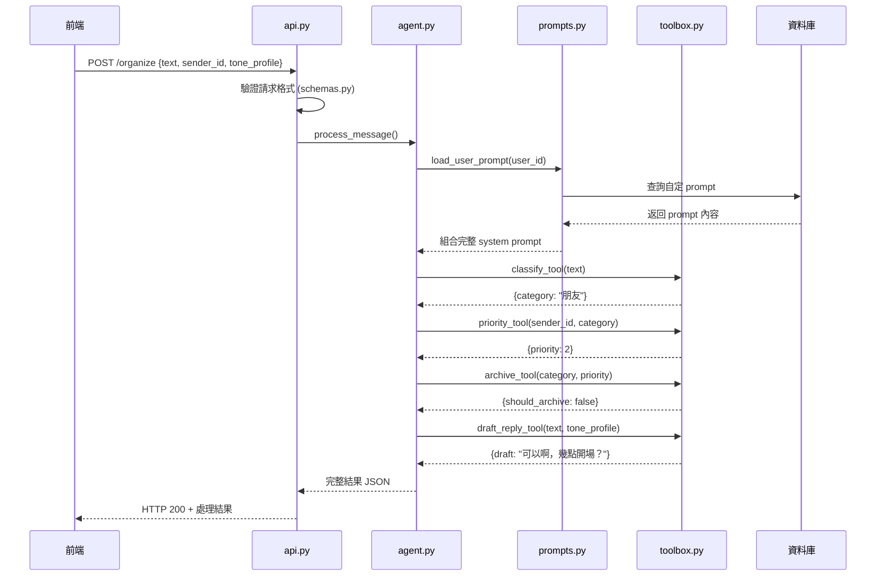

# AI Messenger Agent 專案架構文件

## 專案目錄結構與文件說明

### 核心代碼文件
```
ai_line/
├── src/
│   ├── api.py          # FastAPI 入口 - HTTP 路由與請求處理
│   ├── agent.py        # LangChain Agent 執行器 - 協調所有工具的主控制器
│   ├── toolbox.py      # 五大工具定義 - classify/priority/archive/draft_reply/sort
│   ├── schemas.py      # Pydantic 資料模型 - 定義輸入輸出格式
│   ├── constants.py    # 分類常量 - 存放四大類別等固定值
│   ├── config.py       # 環境與模型設定 - API Key、模型版本等
│   ├── prompts.py      # System Prompt 管理模組
│   └── database.py     # 資料庫連接與操作
├── tests/              # pytest 測試案例
├── docs/               # 專案文件
├── .env.example        # 範例環境變數
└── README.md           # 專案說明
```

---

## 各文件職責詳解

### `api.py` - Web API 入口
**主要功能：**
- 接收前端 HTTP 請求 (`POST /organize`)
- 驗證輸入資料格式
- 呼叫 `agent.py` 處理訊息
- 回傳 JSON 結果給前端
- 管理 System Prompt 的 CRUD 操作

**核心路由：**
```python
POST /organize          # 處理訊息
GET /prompts/{user_id}  # 獲取用戶 prompts
POST /prompts/{user_id} # 儲存新 prompt
PUT /prompts/{user_id}/{prompt_id}/activate # 啟用 prompt
```

### `agent.py` - 核心協調器
**主要功能：**
- 載入 System Prompt 與用戶自定 Prompt
- 初始化 LangChain AgentExecutor
- 依序呼叫 toolbox 中的工具
- 處理錯誤與重試邏輯
- 組合最終結果

**處理流程：**
1. 載入用戶 prompt → 2. 渲染模板 → 3. 建立 Agent → 4. 執行工具鏈 → 5. 回傳結果

### `toolbox.py` - 工具集合
**五大核心工具：**
- `classify_tool`: 分類訊息（工作/朋友/家人/廣告）
- `priority_tool`: 計算優先級（1-5）
- `archive_tool`: 決定是否封存
- `draft_reply_tool`: 生成回覆草稿
- `sort_tool`: 多因子排序（可選）

**特點：**
- 每個工具使用 `@tool` 裝飾器
- 明確的輸入輸出格式
- 可獨立測試與替換

### `schemas.py` - 資料驗證
**定義所有 Pydantic 模型：**
```python
class MessageRequest(BaseModel):
    text: str
    sender_id: str
    tone_profile: ToneProfile
    
class OrganizeResponse(BaseModel):
    category: str
    tags: List[str]
    priority: int
    should_archive: bool
    draft: Optional[str]

class PromptData(BaseModel):
    name: str
    content: str
    is_active: bool = False
```

### `constants.py` - 常量管理
**存放系統常量：**
```python
CATEGORIES = ["工作", "朋友", "家人", "廣告"]
PRIORITY_LEVELS = [1, 2, 3, 4, 5]
DEFAULT_TONE_STYLES = ["正式", "輕鬆", "極簡", "詳細"]
```

### `config.py` - 環境設定
**管理環境變數：**
```python
OPENAI_API_KEY = os.getenv("OPENAI_API_KEY")
MODEL_NAME = os.getenv("MODEL_NAME", "gpt-4o")
DATABASE_URL = os.getenv("DATABASE_URL")
REDIS_URL = os.getenv("REDIS_URL")
```

### `prompts.py` - System Prompt 管理
**核心功能：**
- 載入預設 Prompt 模板
- 管理用戶自定 Prompt
- Jinja2 模板渲染
- 版本控制與切換

### `database.py` - 資料庫操作
**負責：**
- 資料庫連接管理
- User Prompts CRUD 操作
- 訊息歷史記錄
- 聯絡人優先級管理

---

## 系統資訊流程圖



---

## System Prompt 管理架構

### 資料庫設計
```sql
-- 用戶自定 Prompt 表
CREATE TABLE user_prompts (
    id SERIAL PRIMARY KEY,
    user_id VARCHAR(50) NOT NULL,
    name VARCHAR(100) NOT NULL,
    content TEXT NOT NULL,
    is_active BOOLEAN DEFAULT false,
    created_at TIMESTAMP DEFAULT NOW(),
    updated_at TIMESTAMP DEFAULT NOW(),
    UNIQUE(user_id, name)
);

-- 確保每個用戶只有一個活躍 prompt
CREATE UNIQUE INDEX idx_user_active_prompt 
ON user_prompts (user_id) 
WHERE is_active = true;
```

### 預設 Prompt 模板
```jinja2
# Role
你是 {{user_name}}，{{user_profile}}。你的主要任務是協助處理通訊訊息。

# Goal  
對收到的訊息進行以下處理：
1. 分類到四大類別：工作、朋友、家人、廣告
2. 根據發送者設定優先級 (1-5)
3. 判斷是否需要封存
4. 必要時生成符合個人風格的回覆草稿

# Tools
你有以下工具可用：
- classify: 判斷訊息類別
- priority: 設定優先級
- archive: 決定是否封存
- draft_reply: 生成回覆草稿

# Constraint
- 輸出格式必須為有效 JSON
- 語言：繁體中文
- 語調風格：{{tone_style}}
- 回覆字數：{{reply_length}}
- 個人簽名：{{signature}}

# Example
輸入："今晚一起去看電影《沙丘2》好嗎？"
輸出：
{
  "category": "朋友",
  "priority": 2,
  "should_archive": false,
  "draft": "可以啊，幾點開場？{{signature}}"
}
```

### Prompt 管理流程
1. **載入階段**：`agent.py` 啟動時從 `prompts.py` 載入用戶活躍 prompt
2. **渲染階段**：使用 Jinja2 將用戶設定（姓名、風格等）填入模板
3. **執行階段**：LangChain Agent 使用渲染後的 prompt 處理訊息
4. **更新階段**：用戶可透過 API 更新 prompt，即時生效

### 可編輯欄位
用戶可在前端編輯以下欄位：
- `user_name`: 使用者姓名
- `user_profile`: 個人簡介
- `tone_style`: 語調風格（正式/輕鬆/極簡等）
- `reply_length`: 回覆長度偏好
- `signature`: 個人簽名

---

## 已實作的基本監控功能

### 🔍 agent.py 中的監控機制

1. **執行時間追蹤**
   ```python
   start_time = time.time()
   # 執行 Agent 邏輯
   execution_time = time.time() - start_time
   ```

2. **詳細日誌記錄**
   - 使用者ID與訊息內容
   - System Prompt 使用情況
   - 各工具執行結果
   - 總執行時間與 Token 用量

3. **效能警告機制**
   ```python
   if execution_time > PERFORMANCE_THRESHOLDS['MAX_TOTAL_EXECUTION_TIME']:
       logger.warning(f"執行時間超過閾值: {execution_time:.2f}s")
   ```

4. **錯誤處理與回退**
   - 自動捕捉異常並記錄
   - 提供 fallback 回應機制
   - 失敗案例完整追蹤

5. **資料庫日誌**
   - 執行結果存入 `agent_execution_logs` 表
   - 支援後續分析與統計
   - 提供 `get_user_stats()` 介面

### 🎯 監控資料結構
```python
execution_log = {
    'user_id': str,
    'message_text': str,
    'prompt_used': str,
    'tool_results': List[ToolResult],
    'final_response': dict,
    'total_execution_time': float,
    'token_usage': dict,
    'timestamp': datetime
}
```

### 資料庫選擇考量
- PostgreSQL：結構化資料 + JSONB 支援
- Redis：快取與 Session 管理
- 未來可加入 Vector DB（Qdrant）做語義搜尋 

```mermaid
flowchart TD
    FE[前端 React / Flutter]
    WS[WebSocket Gateway]
    MQ[Message Queue (Kafka/Redis)]
    AGENT[LangChain Agent Service]
    TOOLS[Toolbox | classify / priority / archive / draft_reply / sort]
    DB[(Postgres + VectorDB)]
    NOTI[Notification Service]

    FE -- 新訊息 --> WS --> MQ --> AGENT
    AGENT --> TOOLS
    TOOLS --> DB
    AGENT --> NOTI --> FE
```

---

## 擴展計畫

### Phase 1: 基礎功能
- [x] 實作五大核心工具 (`src/toolbox.py`)
- [x] System Prompt 基礎管理 (`src/prompts.py`)
- [x] 基本日誌監控 (`src/agent.py`)
- [ ] 簡單前端 UI

### Phase 2: 進階功能
- [ ] Prompt 版本控制
- [ ] A/B Testing 框架
- [ ] 效能監控與成本追蹤

### Phase 3: 智能化
- [ ] 自動 Prompt 優化建議
- [ ] 向量資料庫整合
- [ ] 多語言支援

---

## 技術決策記錄

### 為什麼選擇 LangChain？
- 成熟的 Agent 生態系統
- 豐富的工具整合
- 良好的社群支援

### 為什麼用 Jinja2 而非純 Python 字串？
- 模板語法更清晰
- 支援條件判斷與迴圈
- 便於非技術人員編輯

### 資料庫選擇考量
- PostgreSQL：結構化資料 + JSONB 支援
- Redis：快取與 Session 管理
- 未來可加入 Vector DB（Qdrant）做語義搜尋 

flowchart TD
    FE[前端 React / Flutter]
    WS[WebSocket Gateway]
    MQ[Message Queue (Kafka/Redis)]
    AGENT[LangChain Agent Service]
    TOOLS[Toolbox | classify / priority / archive / draft_reply / sort]
    DB[(Postgres + VectorDB)]
    NOTI[Notification Service]

    FE -- 新訊息 --> WS --> MQ --> AGENT
    AGENT --> TOOLS
    TOOLS --> DB
    AGENT --> NOTI --> FE 